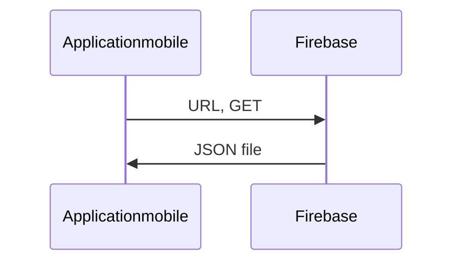
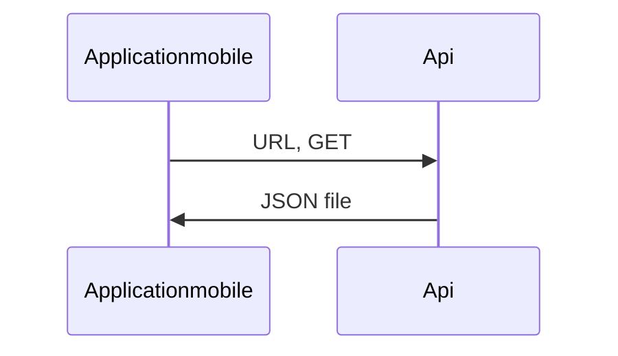

# FastMessengerFireBaseData

Bonjour, nous sommes un groupe de deux étudiants qui ont crées notre application mobile.  Nous devions lors de ce projet répondre à des objectifs fixés. Nous avions mis en place une application en ***Kotlin***.

Mais pour répondre à l'ensemble des objectifs nous devions mettre en place des méthodologies comme : **mvvm** et **Clean** **Architecture**.

 *Liens:* 
Clean Architecture :  https://medium.com/@dmilicic/a-detailed-guide-on-developing-android-apps-using-the-clean-architecture-pattern-d38d71e94029
MVVM :  https://www.raywenderlich.com/8984-mvvm-on-android

 
# Notre projet

Pourquoi le chat et les cryptomonnaies??
-
Présentation du projet:
- 
- **Les fonctionnalités**
- **L'avenir de l'application**

# Pourquoi le chat et les cryptomonnaies?
Notre projet a été lancé, dans l'idée de concevoir une application spécialement faîtes pour les personnes qui sont intéressées par les cryptomonnaies.  

Présentation du projet:
- 
- **Les fonctionnalités**
Nous avons donc pour cela mis en place un chat entre utilisateurs pour qu'ils communiquent à moindre coût mémoire. En effet pour ce projet nous avons donc décidé de travailler avec Firebase pour la partie base de données et stockage des informations (mot de passe, id, messages, photos, etc...).
Suite à cela notre application vous permet de voir en temps réel toutes les heures, la variance des prix des cryptomonnaies, par exemple.

- **L'avenir de l'application**
Notre projet a encore beaucoup de chemin à faire. Nous pourrions y rajouter des courbes, pour montrer l'évolution de chacune des monnaies mais également, un système de prédiction afin de faire jouer nos utilisateurs à prédire la somme qu'il pourrait gagné s'ils avaient mis une somme d'argent sur une monnaie en particulier.

> **Note:**  Si vous n'arrivez pas à lancer le projet contactez-moi, sur ma boîte mail: verdy@et.esiea.fr
> 

*Schéma intéractif de notre application mobile:*

**Firebase/ ApplicationMobile**

**API / ApplicationMobile**

